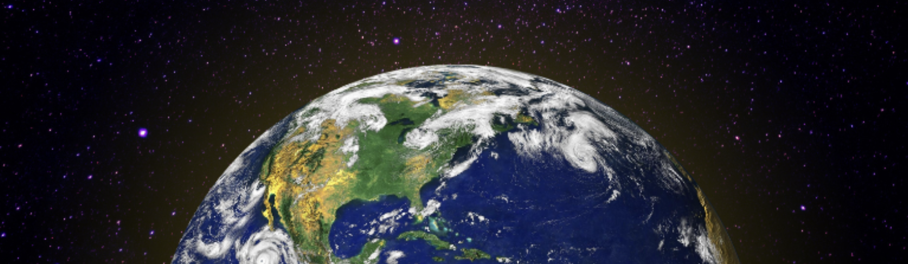
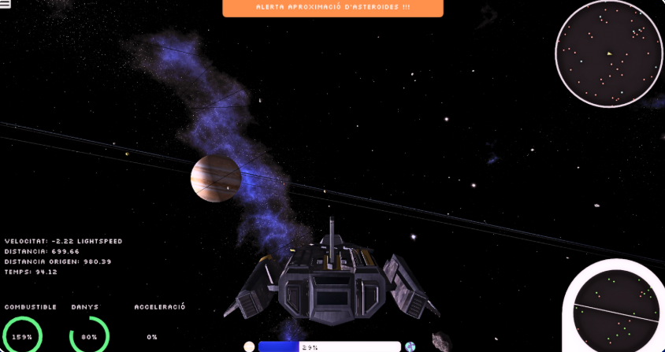
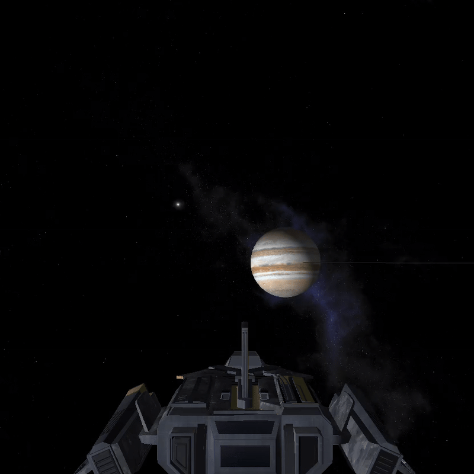
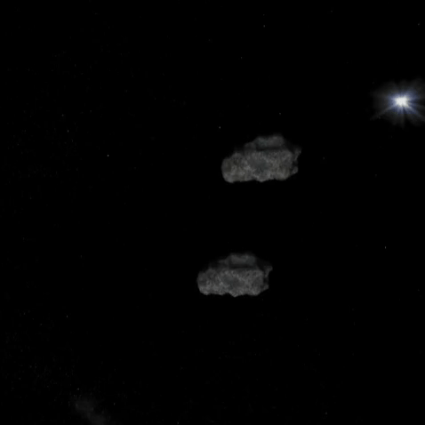

# Solar Sprint

This repository contains the source code for **Solar Sprint**, a hybrid 3D space simulator and game developed from scratch using C++ and OpenGL. 

This project was developed with **educational purposes** in mind, offering an engaging and informative space experience focused on realistic physics and orbital mechanics.

  
  
  

  <a href="#about-the-project">About the Project</a> •
  <a href="#game-modes">Game Modes</a> •
  <a href="#key-features">Key Features</a> •
  <a href="#tech-stack">Tech Stack</a> •
  <a href="#license">License</a> •
  <a href="#credits">Credits</a>

---

## About the Project

**Solar Sprint** puts the player in control of a spacecraft capable of exploring the solar system. The simulator takes into account real-time collisions with asteroids and realistic physics for planets, satellites, and the spacecraft itself.

To enhance immersion, the game includes realistic Sun lighting, accurate planetary orbits, and immersive particle effects. A mini-map helps locate celestial bodies, and informative pop-ups provide real-time updates on the spacecraft’s status. 

## Game Modes

The game features two main modes to cater to different playstyles:

* **Structured Gameplay:** The player selects an origin and destination planet or satellite, following the optimal trajectory while collecting fuel and avoiding asteroid collisions.
* **Free Exploration Mode:** Navigate the solar system without restrictions on fuel or health, allowing players to freely admire the physics, environments, and celestial bodies.

  
  
<i>Preview: Navigation and mission-based gameplay.</i>

## Key Features

* **Realistic Physics & Collisions:** Accurate physics for planets, satellites, and spacecraft. Experience real-time collision detection with high-speed asteroids.
  
  

    
  

* **Advanced Movement:** The spacecraft moves with six degrees of freedom (6DOF), utilizing gravity assists to optimize trajectories and fuel usage.
* **Orbital Mechanics:** Orbits are calculated using Newton’s Law of Universal Gravitation for realistic planetary motion, including parameters like inclination and orbital velocity.
* **Immersive Visuals:** Features realistic Sun lighting, accurate planetary orbits, and immersive particle effects. 3D models are sourced from SketchFab.
* **Interactive UI:** Health and fuel bars to monitor spacecraft status, alongside a mini-map and real-time informative pop-ups.
* **Multiple Camera Views:** Switch between third-person, first-person, and rear views for different perspectives.
* **Controller Support:** Full XBOX controller support for intuitive and seamless gameplay.

## Tech Stack

### Core Engine & Programming

### Assets & 3D Models

## License
This project is licensed under the [MIT License](LICENSE).  
© 2024–present [Contributors](https://github.com/laranyeta/solar-sprint/contributors)
